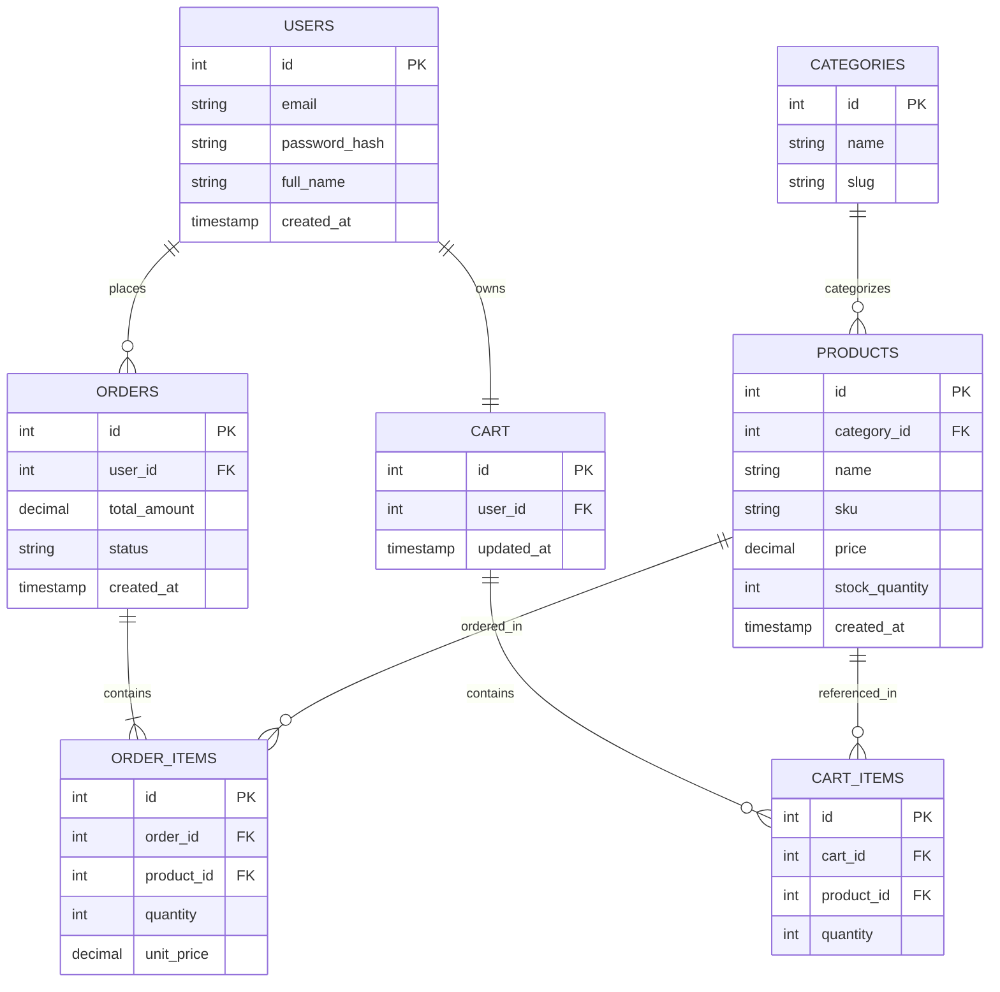

# Sprint 1: System Architecture & Scope Definition

**Course:** E-Commerce
**Repository:** ecommerce-[2K23/CSM/59]
**Path:** /docs/SPRINT_1.md

---

## Section 1: Target Audience & Market Focus

- **Primary Persona:** Small-to-medium retail business owners who want to sell physical products online without building custom infrastructure, alongside the retail consumers who shop on their storefronts.
- **Core Pain Point:** Small sellers lack an affordable, easy-to-manage platform that handles catalog browsing, cart persistence, and secure checkout without requiring a dedicated engineering team.
- **Domain Scope:** Consumer Electronics — a vertical with well-defined product attributes (brand, SKU, specs, stock levels) that map cleanly onto a relational schema, and enough category depth (phones, accessories, audio, computing) to meaningfully exercise catalog and inventory features.

---

## Section 2: MVP Feature Scope

| Category | Feature Name | Description | Priority |
|---|---|---|---|
| Authentication | User Registration & Authentication | Password hashing (bcrypt) and JWT-based session authentication for signup/login. | High (MVP) |
| Catalog | Product List & Search | Product browsing interface with category-based filtering and keyword search. | High (MVP) |
| Cart | Cart Management | Persistent cart state (add, update quantity, remove items) tied to the user account. | High (MVP) |
| Checkout | Order Processing | Mock/Stripe payment gateway integration and order object instantiation on successful payment. | High (MVP) |
| Admin | Inventory Control | Administrative CRUD operations for products and stock levels. | Medium |
| Catalog | Product Detail View | Single-product page showing full specs, price, stock status, and images. | Medium |

---

## Section 3: Tech Stack Selection & Justification

- **Frontend Framework: React (with Vite)**
  Justification: React's component model fits a catalog/cart/checkout UI well, and the large ecosystem (React Router, React Query) reduces the amount of custom plumbing needed within a single semester.

- **Backend Infrastructure: Node.js / Express**
  Justification: Express keeps the API layer lightweight and fast to iterate on, and using JavaScript on both ends of the stack lowers context-switching cost for a small student team compared to introducing a second language like Python or Java.

- **Database Management System: PostgreSQL**
  Justification: The domain (users, products, orders, order items) is inherently relational with strict referential integrity needs (an order item must reference a real order and product), which PostgreSQL enforces far more reliably than a document store like MongoDB.

- **Caching & Asynchronous Processing (Optional): Redis**
  Justification: Redis can back session/cart-token storage and rate-limit login attempts, offloading that traffic from PostgreSQL without adding a heavyweight task queue the team doesn't yet need.

---

## Section 4: Entity-Relationship Diagram (ERD)

### Entities, Keys, and Cardinality

- **Users (1) → Orders (N):** one user places many orders.
- **Users (1) → Cart (1):** one user has one active cart.
- **Cart (1) → Cart_Items (N):** one cart holds many cart items.
- **Products (1) → Cart_Items (N):** one product can appear in many cart items.
- **Orders (1) → Order_Items (N):** one order contains many order line items.
- **Products (1) → Order_Items (N):** one product can appear in many order items (N:M between Orders and Products, resolved via Order_Items).
- **Categories (1) → Products (N):** one category classifies many products.

### Mermaid Diagram

